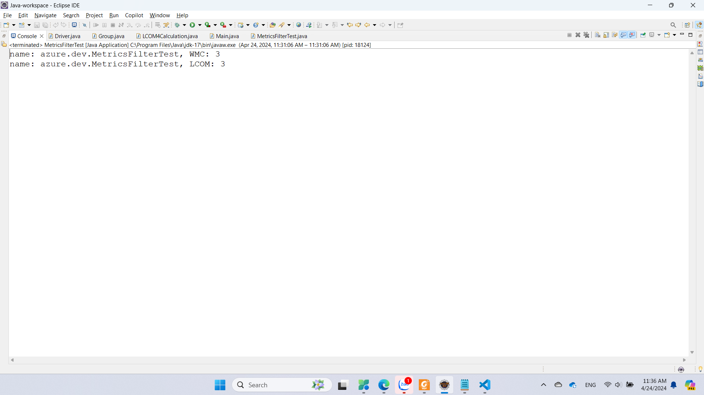
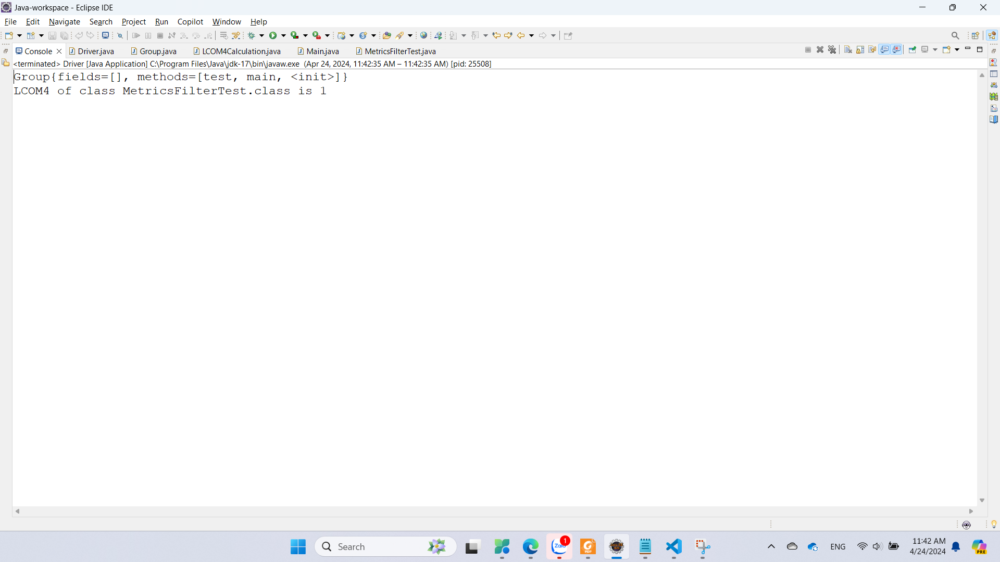
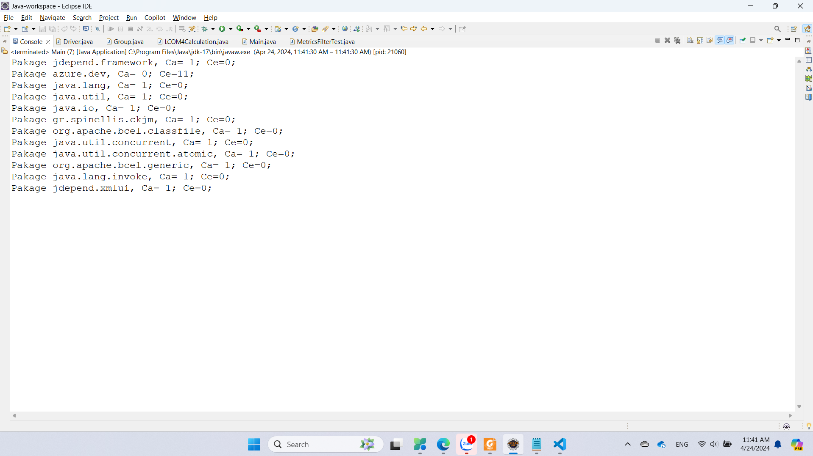

# Họ tên: VÕ ĐÌNH THÔNG

# MSSV: 21082081

#### CKJM: Java code for calculate Chidamber and Kemerer Java Metrics



#### BCEL Determining the LCOM4 (Lack of Cohesion in Methods) by parsing the Java Bytecode using BCEL (Byte Code Engineering Library)



#### JDepend A library for calculate coupling and others metrics



#### Generate report

```xml
<?xml version="1.0"?>
<JDepend>
    <Packages>

        <Package name="azure.dev">
            <Stats>
                <TotalClasses>6</TotalClasses>
                <ConcreteClasses>6</ConcreteClasses>
                <AbstractClasses>0</AbstractClasses>
                <Ca>0</Ca>
                <Ce>9</Ce>
                <A>0</A>
                <I>1</I>
                <D>0</D>
                <V>1</V>
            </Stats>

            <AbstractClasses>
            </AbstractClasses>

            <ConcreteClasses>
                <Class sourceFile="Driver.java">
                    azure.dev.Driver
                </Class>
                <Class sourceFile="Group.java">
                    azure.dev.Group
                </Class>
                <Class sourceFile="LCOM4Calculation.java">
                    azure.dev.LCOM4Calculation
                </Class>
                <Class sourceFile="Main.java">
                    azure.dev.Main
                </Class>
                <Class sourceFile="MetricsFilterTest.java">
                    azure.dev.MetricsFilterTest
                </Class>
                <Class sourceFile="MetricsFilterTest.java">
                    azure.dev.MetricsFilterTest$1
                </Class>
            </ConcreteClasses>

            <DependsUpon>
                <Package>gr.spinellis.ckjm</Package>
                <Package>java.io</Package>
                <Package>java.lang</Package>
                <Package>java.lang.invoke</Package>
                <Package>java.util</Package>
                <Package>java.util.concurrent</Package>
                <Package>java.util.concurrent.atomic</Package>
                <Package>jdepend.framework</Package>
                <Package>jdepend.xmlui</Package>
            </DependsUpon>

            <UsedBy>
            </UsedBy>
        </Package>

        <Package name="gr.spinellis.ckjm">
            <error>No stats available: package referenced, but not analyzed.</error>
        </Package>

        <Package name="java.io">
            <error>No stats available: package referenced, but not analyzed.</error>
        </Package>

        <Package name="java.lang">
            <error>No stats available: package referenced, but not analyzed.</error>
        </Package>

        <Package name="java.lang.invoke">
            <error>No stats available: package referenced, but not analyzed.</error>
        </Package>

        <Package name="java.util">
            <error>No stats available: package referenced, but not analyzed.</error>
        </Package>

        <Package name="java.util.concurrent">
            <error>No stats available: package referenced, but not analyzed.</error>
        </Package>

        <Package name="java.util.concurrent.atomic">
            <error>No stats available: package referenced, but not analyzed.</error>
        </Package>

        <Package name="jdepend.framework">
            <error>No stats available: package referenced, but not analyzed.</error>
        </Package>

        <Package name="jdepend.xmlui">
            <error>No stats available: package referenced, but not analyzed.</error>
        </Package>
    </Packages>

    <Cycles>
    </Cycles>
</JDepend>

```
